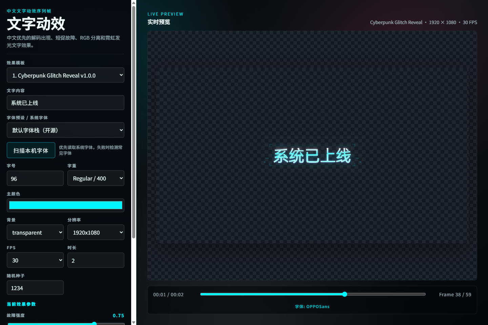

# 中文文字动效序列帧生成器 MVP

这是一个本地网页工具，用来生成中文文字动画的 PNG 序列帧。当前重点不是做完整软件，而是验证“代码生成的文字动效”能不能达到可以放进 AE、Premiere、DaVinci Resolve 等软件继续合成的质感。

默认效果是 **Cyberpunk Glitch Reveal**。它关注文字本体：解码出现、故障错位、RGB 分离、霓虹发光和扫描线，同时保留少量围绕文字的小线条/小方块装饰。工具不会默认生成全屏大边框或复杂 HUD 面板。



## 安装

```bash
npm install
```

## 运行

```bash
npm run dev
```

打开 Vite 显示的本地地址。默认配置是 `http://127.0.0.1:5173/`。

## 构建

```bash
npm run build
```

## 使用方式

1. 输入中文文字，例如 `系统已上线`、`任务开始`、`警告 即将过载`。
2. 选择效果模板。
3. 调整字体、字号、颜色、分辨率、FPS、时长和效果参数。
4. 用预览区确认动画质感。
5. 点击 **导出 PNG ZIP**。
6. 解压 ZIP，把 PNG 序列帧导入剪辑或合成软件。

导出的文件名格式：

```txt
text_anim_0000.png
text_anim_0001.png
text_anim_0002.png
```

选择 `transparent` 背景时，PNG 会保留透明通道。

## 字体选择

页面提供三种方式：

- 常用中文字体预设。
- 手动输入 `font-family`。
- 点击 **扫描本机字体**，在浏览器支持并授权后读取系统字体列表。

注意：网页不能在所有浏览器中无条件读取系统字体。系统字体扫描依赖浏览器的 Local Font Access API，也就是 `queryLocalFonts()`。如果浏览器不支持或用户拒绝授权，仍然可以使用预设字体或手动输入字体名。

## 新增效果模板

效果模板统一放在：

```txt
src/effects/templates/
```

模板必须导出：

```ts
export const effect = defineTextEffect({
  id: "my-effect",
  name: "My Effect",
  version: "1.0.0",
  description: "效果说明",
  render(ctx, params) {
    // 绘制当前帧
  },
});
```

主程序会自动读取模板目录中的效果，并显示在“效果模板”下拉框里。详细规范见 `docs/EFFECT_AUTHORING.md`。

## 当前限制

- 只导出 PNG 序列帧 ZIP，不导出视频。
- 渲染使用 Canvas 2D，暂不接 PixiJS/WebGL。
- 不做 AI prompt、复杂 timeline、模板市场、登录、云端工程管理。
- 其他模型生成的效果代码需要经过本地构建检查，不支持网页粘贴代码后直接运行。
